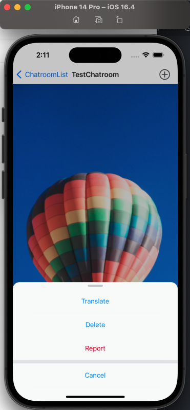
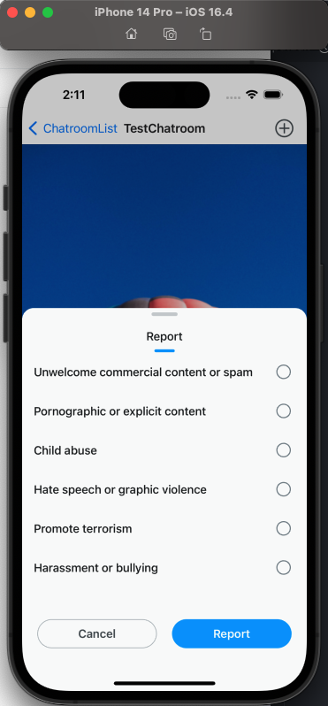
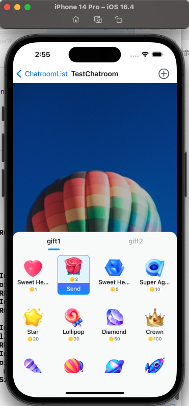

- [组件概述](#组件概述)
  - [主题介绍](#主题介绍)
  - [国际化介绍](#国际化介绍)
  - [初始化介绍](#初始化介绍)
  - [Chatroom 组件](#chatroom-组件)
    - [属性详细介绍](#属性详细介绍)
      - [containerStyle](#containerstyle)
      - [GiftMessageList](#giftmessagelist)
      - [GlobalBroadcast](#globalbroadcast)
      - [MessageList](#messagelist)
      - [InputBar](#inputbar)
      - [BottomSheetParticipantList](#bottomsheetparticipantlist)
    - [方法详细介绍](#方法详细介绍)
      - [getGlobalBroadcastRef](#getglobalbroadcastref)
      - [getGiftMessageListRef](#getgiftmessagelistref)
      - [getParticipantListRef](#getparticipantlistref)
      - [getMessageListRef](#getmessagelistref)
      - [joinRoom](#joinroom)
      - [leaveRoom](#leaveroom)
  - [MessageList 组件](#messagelist-组件)
  - [ParticipantList 组件](#participantlist-组件)
  - [GiftMessageList 组件](#giftmessagelist-组件)
  - [GlobalBroadcast 组件](#globalbroadcast-组件)
  - [InputBar 组件](#inputbar-组件)
  - [InputBarStyle 组件](#inputbarstyle-组件)
  - [BottomSheetGift 组件](#bottomsheetgift-组件)
  - [更多](#更多)

# 组件概述

`room uikit sdk` 主要包括如下组件：

| 组件名称        | 组件介绍                                                             | 链接                                |
| --------------- | -------------------------------------------------------------------- | ----------------------------------- |
| Theme           | 可以设置`UIKit`所有组件的颜色、样式、可以切换 `light` 和`dark`主题。 | [主题介绍](#主题介绍)               |
| I18n            | 可以设置`UIKit`所有 UI 组件的语言。                                  | [国际化介绍](#国际化介绍)           |
| Chatroom        | 聊天室组件，集成了礼物发送、消息列表、成员列表、礼物接收等组件。     | [Chatroom](#Chatroom)               |
| MessageList     | 聊天室的消息列表显示组件，用来显示发送或者接收到的消息。             | [MessageList](#MessageList)         |
| ParticipantList | 聊天室的成员列表组件，包括聊天室成员和禁言成员的管理。               | [ParticipantList](#ParticipantList) |
| GiftMessageList | 打赏消息列表组件，用来显示打赏的礼物。                               | [GiftMessageList](#GiftMessageList) |
| GlobalBroadcast | 聊天室全局广播组件，所有的聊天室都会收到。                           | [GlobalBroadcast](#GlobalBroadcast) |
| InputBar        | 消息输入组件，用来发送各类消息。                                     | [InputBar](#InputBar)               |
| InputBarStyle   | 底部功能区域组件，可以切换消息输入组件，可以添加自定义按钮。         | [InputBarStyle](#InputBarStyle)     |
| BottomSheetGift | 发送礼物组件，可以发送礼物，礼物来源由开发者指定。                   | [BottomSheetGift](#BottomSheetGift) |
| BottomSheetGift | 发送礼物组件，可以发送礼物，礼物来源由开发者指定。                   | [BottomSheetGift](#BottomSheetGift) |

## 主题介绍

每个 UI 组件都会用到主题，主题服务提供了`light`和`dark`主题。支持一键切换。

简单示例如下：

```tsx
// ...
// 定义主题设置状态
const palette = usePresetPalette();
const dark = useDarkTheme(palette);
const light = useLightTheme(palette);
const [theme, setTheme] = React.useState(light);
// ...
// 添加组件到渲染树
<Container appKey={env.appKey} palette={palette} theme={theme} />;
// ...
// 更改主题设置
setTheme(theme === light ? dark : light);
```

自定义主题颜色。 `usePresetPalette` 可以使用内置的默认主题颜色，也可以使用 `useCreatePalette` 设置自定义主题颜色。

```tsx
// 自定义颜色。通过修改颜色具体值，组件中对应颜色将统一改变。
// 参考这里：https://www.figma.com/file/OX2dUdilAKHahAh9VwX8aI/Streamuikit?type=design&node-id=101-41012&mode=design&t=Fzou3Gwsk4owLLbr-4
const { createPalette } = useCreatePalette({
  colors: {
    primary: 203,
    secondary: 155,
    error: 350,
    neutral: 203,
    neutralSpecial: 220,
  },
});
const palette = createPalette();
// ...
```

## 国际化介绍

UIKit 支持多国语言切换，目前内置中文和英文。支持扩展其他语言。

例如：想要让 UIKit 使用英文显示，可以如下设置：

```tsx
<Container appKey={env.appKey} language={'en'} />
```

语言设置规则：

- 如果没有设置语言，则使用默认系统语言。
- 如果系统语言不是中文或者英文，则国内选择中文，国外选择英文。
- 如果设置语言不是中文或者英文，并且没有提供相应的语言集合，则国内选择中文，国外选择英文。

例如：如果应用开发者需要设置中文语言，并且希望应用本身也能够使用，可以这样设置：

```tsx
// ...
// 创建应用需要的语言包
function createLanguage(type: LanguageCode): StringSet {
  return {
    'Chinese text.': '中文文本.',
  };
}
// ...
// 设置指定语言集合，并且提供语言翻译源
<Container
  appKey={env.appKey}
  language={'zh-Hans'}
  languageExtensionFactory={createLanguage}
/>;
// ...
// 在需要国际化的地方
const { tr } = useI18nContext();
return <Text>{tr('Chinese text.')}</Text>;
```

例如：如果应用开发者想要设置法语，并且希望应用和 UIKit 都显示法语，可以这样设置：

```tsx
// ...
// 创建应用扩展语言集合
function createAppLanguage(type: LanguageCode): StringSet {
  if (type === 'fr') {
    return {
      'French text.': 'Texte français.',
    };
  }
  return {
    'French text.': 'French text.',
  };
}
// 创建UIKit的语言集合，需要找到UIKit内置的文件 `StringSet.en.tsx`, 将所有的 `value` 修改为法语版本。
export function createUIKitLanguage(type: LanguageCode): StringSet {
  if (type === 'fr') {
    return {
      'Private Chat': 'Private Chat',
      '...': '...',
    };
  }
}
// ...
// 设置指定语言集合，并且提供语言翻译源
<Container
  appKey={env.appKey}
  language={'fr'}
  languageBuiltInFactory={createUIKitLanguage}
  languageExtensionFactory={createAppLanguage}
/>;
```

## 初始化介绍

`Chatroom UIKit SDK` 的入口就是 `Container` 组件，它主要负责集成其他组件和参数配置。

```tsx
export type ContainerProps = React.PropsWithChildren<{
  appKey: string;
  isDevMode?: boolean;
  language?: StringSetType;
  languageBuiltInFactory?: CreateStringSet;
  languageExtensionFactory?: CreateStringSet;
  palette?: Palette;
  theme?: Theme;
  roomOption?: PartialRoomOption;
  avatar?: {
    borderRadiusStyle?: CornerRadiusPaletteType;
  };
  onInitialized?: () => void;
}>;
```

```tsx
// 主要控制聊天室组件里面的组件是否加载。
export type RoomOption = {
  globalBroadcast: {
    isVisible: boolean;
  };
  gift: {
    isVisible: boolean;
  };
  messageList: {
    isVisibleGift: boolean;
    isVisibleTime: boolean;
    isVisibleTag: boolean;
    isVisibleAvatar: boolean;
  };
};
```

除了 `appKey` 之外都是可选参数。

- isDevMode: 如果设置为 `true`，则激活日志打印等工具。
- language: 设置当前的语言，如果没有设置，则获取系统当前的语言作为默认值。
- languageBuiltInFactory: 如果没有设置则使用内置的语言资源。通常可以修改内置的UI内容。
- languageExtensionFactory: 如果设置将扩展语言资源。通常应用的UI也需要国际化。
- palette: 设置当前的调色板，主题服务的重要依赖。
- theme: 如果没有设置主题，将使用 `light` 为默认主题。
- roomOption: 聊天室选项。具体参见 全局配置服务。
- avatar: 设置全局头像的圆角样式
- onInitialized：初始化完成的回调通知

通常 `Container` 会处于应用的底层，一般为根组件，或者是根组件同一级别。例如：

```tsx
export function App() {
  return <Container appKey={'your app key'}>{children}</Container>;
}
```

## Chatroom 组件

聊天室组件是包括成员列表组件、输入组件、消息列表组件、打赏消息组件、全局广播通知组件、菜单组件等的集合。它是一个页面级组件，基本占据了这个屏幕。如果想要添加组件，建议成为它的子组件或者背景组件。

简单示例如下：

```tsx
// ...
// 创建引用对象
const ref = React.useRef<Chatroom>({} as any);
// ...
// 添加组件到渲染树
<Chatroom ref={chatroomRef} roomId={room.roomId} ownerId={room.owner} />;
```

由于 `UIKit` 没有路由 （`React-Native` 没有内置），所以，这里如果需要进行成员搜索，需要像下面这样设置。

```tsx
<Chatroom
  ref={chatroomRef}
  participantList={{
    props: {
      onSearch: (memberType) => {
        // todo: 点击搜索按钮跳转到搜索页面
        navigation.push('SearchParticipant', { params: { memberType } });
      },
    },
  }}
  roomId={room.roomId}
  ownerId={room.owner}
/>
```

`Chatroom`提供的属性概览

| 属性                       | 是否可选 | 介绍                                                 |
| -------------------------- | -------- | ---------------------------------------------------- |
| containerStyle             | 可选     | 设置组件容器样式。支持背景、位置、大小、边框等的设置 |
| GiftMessageList            | 可选     | 打赏消息组件的渲染器                                 |
| GlobalBroadcast            | 可选     | 全局广播组件的渲染器                                 |
| MessageList                | 可选     | 消息列表组件的渲染器                                 |
| InputBar                   | 可选     | 输入组件的渲染器                                     |
| BottomSheetParticipantList | 可选     | 成员列表组件的渲染器                                 |
| input                      | 可选     | 输入组件的属性                                       |
| messageList                | 可选     | 消息列表的属性                                       |
| globalBroadcast            | 可选     | 聊天室全局广播                                       |
| gift                       | 可选     | 打赏消息的属性                                       |
| participantList            | 可选     | 成员列表的属性                                       |
| backgroundView             | 可选     | 背景组件                                             |

`Chatroom`提供的方法概览

| 方法                  | 介绍                                       |
| --------------------- | ------------------------------------------ |
| getGlobalBroadcastRef | 获取`GlobalBroadcast`的组件引用            |
| getGiftMessageListRef | 获取`GiftMessageList`的组件引用            |
| getParticipantListRef | 获取`BottomSheetParticipantList`的组件引用 |
| getMessageListRef     | 获取`MessageList`的组件引用                |
| joinRoom              | 加入聊天室                                 |
| leaveRoom             | 退出聊天室                                 |


### 属性详细介绍

#### containerStyle

该属性可以控制 `Chatroom` 组件的背景、位置、大小、边框等样式。

#### GiftMessageList

默认使用内部组件 `GiftMessageList`。
可以设置类型为 `GiftMessageListComponent` 的自定义组件。替换之后的行为完全由开发者控制，如果在 `GiftMessageList` 组件的基础上进行扩展或者修改将事半功倍的效果。

#### GlobalBroadcast

默认使用内部组件 `GlobalBroadcast`.
可以设置类型为 `GlobalBroadcastComponent` 的自定义组件。

#### MessageList

默认使用内部组件 `MessageList`.
可以设置类型为 `MessageListComponent` 的自定义组件。

#### InputBar

默认使用内部组件 `InputBar`.
可以设置类型为 `InputBarComponent` 的自定义组件。
这个组件包括了 `InputBarStyle` 组件。 如果自定义可能需要注意。

#### BottomSheetParticipantList

默认使用内部组件 `BottomSheetParticipantList`.
可以设置类型为 `BottomSheetParticipantListComponent` 的自定义组件。

### 方法详细介绍

#### getGlobalBroadcastRef

该方法可以获取 `GlobalBroadcast` 组件的引用，
默认是通过收到后台的消息广播进行显示，这里开发者可以插入自定义的全局广播消息。

#### getGiftMessageListRef

该方法可以获取 `GiftMessageList` 组件的引用。

#### getParticipantListRef

该方法可以获取 `BottomSheetParticipantList` 组件的引用。
这里开发者可以自定义成员管理相关内容。

#### getMessageListRef

该方法可以获取`MessageList`的组件引用。
默认通过发送消息或者接收消息显示消息，这里开发者可以手动插入自定义消息、删除消息、滚动到最下面等操作。

#### joinRoom

当加载 `Chatroom` 组件，自动加入房间，有时候由于网络等问题，加入失败，开发者可以通过该方法重新尝试加入房间。

#### leaveRoom

开发者可以通过该方法退出房间，而不用卸载组件。

## MessageList 组件

聊天室消息区域组件`MessageList`提供消息的显示，聊天室接收到的文本消息、表情消息、礼物消息，发送成功的消息会显示在这里。

消息列表可以对消息进行操作。例如：翻译文本消息为目标语言、撤销消息、消息上报等。 通过长按消息列表项弹出菜单进行相应操作。

数据上报组件支持自定义选项，可以自定义选项上报不同内容。

简单使用示例：

```tsx
// ...
// 创建组件引用对象
const ref = React.useRef<MessageListRef>({} as any);
// 添加消息列表组件到渲染树
<MessageList ref={ref} />;
// ...
// 添加消息到消息列表，消息会显示在列表
ref?.current?.addSendedMessage?.(message);
```

`MessageList`提供的属性概览

| 属性                     | 是否可选 | 介绍                                                            |
| ------------------------ | -------- | --------------------------------------------------------------- |
| visible                  | 可选     | 设置组件是否可见                                                |
| onUnreadCount            | 可选     | 未读数发生变化时的回调通知                                      |
| onLongPressItem          | 可选     | 长按消息列表项时的回调通知                                      |
| containerStyle           | 可选     | 设置组件容器样式。支持背景、位置、大小、边框等的设置            |
| onLayout                 | 可选     | 组件布局发生变化时的回调通知                                    |
| MessageListItemComponent | 可选     | 消息列表项的渲染器                                              |
| reportProps              | 可选     | 消息上报的属性                                                  |
| maxMessageCount          | 可选     | 组件可以显示的最大消息数，默认 1000，超过限制后将回收最早消息。 |
| messageMenuItems         | 可选     | 自定义消息菜单项，追加到内置菜单后面                            |

`MessageList`提供的方法概览

| 方法             | 介绍                             |
| ---------------- | -------------------------------- |
| addSendedMessage | 将输入框里面的内容发送到消息列表 |
| scrollToEnd      | 滚动消息列表到底部               |




## ParticipantList 组件

聊天室成员组件可以显示和管理聊天室成员，房间拥有者还有禁言列表以及管理权限。

房间拥有者可以更改成员状态。例如：对某个成员禁言，将某个成员踢出聊天室。

**注意** 聊天室成员列表组件的显示的入口并不在 `UIKit`, 所以，需要应用开发者自行实现。例如：添加一个按钮点击触发显示聊天室成员列表组件。

`BottomSheetParticipantList`组件是 `SimulativeModal` 和 `ParticipantList` 组成的。是一个独立的组件，可以进行显示和隐藏。

简单示例如下：

```tsx
// ...
// 创建组件引用对象
const ref = React.useRef<BottomSheetParticipantListRef>({} as any);
// 添加成员列表组件到渲染树
<BottomSheetParticipantList ref={this.ref} />;
// ...
// 用户实现现实具体动作，例如：添加按钮，点击按钮显示成员列表组件。
ref?.current?.startShow?.();
```

`BottomSheetParticipantList`提供的属性概览

| 属性                | 是否可选 | 介绍                                                 |
| ------------------- | -------- | ---------------------------------------------------- |
| onSearch            | 可选     | 点击搜索样式的回调通知                               |
| onNoMoreMember      | 可选     | 下滑加载更多成员时，没有更多成员的回调通知           |
| containerStyle      | 可选     | 设置组件容器样式。支持背景、位置、大小、边框等的设置 |
| maskStyle           | 可选     | 设置组件容器以外区域样式。                           |
| MemberItemComponent | 可选     | 成员列表项的渲染器                                   |

`BottomSheetParticipantList`提供的方法概览

| 方法                  | 介绍                                     |
| --------------------- | ---------------------------------------- |
| startShow             | 显示成员列表组件                         |
| startHide             | 隐藏成员列表组件，隐藏动画完成后返回通知 |
| getParticipantListRef | 获取成员列表或者禁言列表组件的引用       |

`ParticipantList`提供的方法概览。

| 方法         | 介绍                                           |
| ------------ | ---------------------------------------------- |
| initMenu     | 初始化自定义成员列表菜单，追加到内置菜单的后面 |
| removeMember | 删除成员                                       |
| muteMember   | 禁言或者解除禁言成员                           |
| closeMenu    | 关闭菜单                                       |


## GiftMessageList 组件

打赏消息组件用来展示发送的礼物效果，礼物消息可以显示在消息列表，也可以显示在该组件。

简单使用示例：

```tsx
// ...
// 创建组件引用对象
const ref = React.useRef<GiftMessageListRef>({} as any);
// 添加组件到渲染树
<GiftMessageList ref={ref} />;
// ...
// 添加礼物消息到组件消息队列中，排队显示。
ref.current?.pushTask({
  model: {
    id: seqId('_gf').toString(),
    nickName: 'NickName',
    giftCount: 1,
    giftIcon: 'http://notext.png',
    content: 'send Agoraship too too too long',
  },
});
```

`GiftMessageList`提供的属性概览

| 属性                    | 是否可选 | 介绍                                           |
| ----------------------- | -------- | ---------------------------------------------- |
| visible                 | 可选     | 设置组件是否可见                               |
| containerStyle          | 可选     | 设置组件容器样式。支持背景、位置、边框等的设置 |
| GiftEffectItemComponent | 可选     | 打赏消息列表项的渲染器                         |

`GiftMessageList`提供的方法概览

| 方法     | 介绍                                 |
| -------- | ------------------------------------ |
| pushTask | 将礼物消息任务添加到队列中，排队加载 |

## GlobalBroadcast 组件

全局广播通知组件接收和现实全局全局广播。也是通过添加消息到队列排队显示。

简单示例如下：

```tsx
// ...
// 创建组件引用对象
const ref = React.useRef<GlobalBroadcastRef>({} as any);
// ...
// 添加组件到渲染树
<GlobalBroadcast ref={ref} />;
// ...
// 将消息添加到任务队列，排队显示。
let count = 1;
ref.current?.pushTask?.({
  model: {
    id: count.toString(),
    content: count.toString() + content,
  },
});
```

`GlobalBroadcast`提供的属性概览

| 属性                    | 是否可选 | 介绍                                                 |
| ----------------------- | -------- | ---------------------------------------------------- |
| visible                 | 可选     | 设置组件是否可见                                     |
| playSpeed               | 可选     | 消息播放时滚动的速度，默认值 8                       |
| containerStyle          | 可选     | 设置组件容器样式。支持背景、位置、大小、边框等的设置 |
| textStyle               | 可选     | 设置组件文本样式                                     |
| icon                    | 可选     | 设置组件上的图标样式                                 |
| GiftEffectItemComponent | 可选     | 打赏消息列表项的渲染器                               |
| onFinished              | 可选     | 所有消息播放完成时的回调通知                         |
| onLayout                | 可选     | 组件布局发生变化时的回调通知                         |

`GlobalBroadcast`提供的方法概览

| 方法     | 介绍                         |
| -------- | ---------------------------- |
| pushTask | 将消息添加到队列中，排队加载 |

## InputBar 组件

输入框组件可以发送文本、表情消息。 同时和 输入框组件组合为可以动态切换的组件。当点击输入框样式组件时切换到输入状态，发送消息或者关闭输入框时切换为输入框样式组件。

简单示例如下：

```tsx
// ...
// 创建引用对象
const ref = React.useRef<InputBarRef>({} as any);
// ...
// 添加组件到渲染树
<InputBar
  ref={ref}
  onSended={(_content, message) => {
    // todo: 调用消息列表引用对象添加消息到消息列表
  }}
/>;
// ...
// 关闭输入状态
ref?.current?.close?.();
```

`InputBar`提供的属性概览

| 属性                   | 是否可选 | 介绍                                          |
| ---------------------- | -------- | --------------------------------------------- |
| onInputBarWillShow     | 可选     | 将要切换为输入状态时的回调通知                |
| onInputBarWillHide     | 可选     | 将要切换为输入样式状态时的回调通知            |
| onSended               | 可选     | 发送完成时的回调通知                          |
| keyboardVerticalOffset | 可选     | 键盘偏移量的数值                              |
| closeAfterSend         | 可选     | 发送消息后是否切换为输入样式状态              |
| first                  | 可选     | 输入样式组件的第一个自定义组件                |
| after                  | 可选     | 输入样式组件的后面的自定义组件列表，最多 3 个 |
| onLayout               | 可选     | 输入样式组件布局发生变化时的回调通知          |

`InputBar`提供的方法概览

| 方法  | 介绍                                 |
| ----- | ------------------------------------ |
| close | 主动关闭输入状态，切换为输入样式状态 |


## InputBarStyle 组件

输入样式组件。和输入框组件组成了复合组件，可以动态进行切换。

## BottomSheetGift 组件

礼物列表组件提供自定义礼物列表，点击礼物项的发送按钮发送到聊天室。

**注意** 礼物列表组件是一个独立的组件，需要应用开发者自行实现显示和加载等操作。

简单示例如下：

```tsx
// ...
// 创建引用对象
const ref = React.useRef<BottomSheetGiftSimuRef>({} as any);
// ...
// 添加组件到渲染树
<BottomSheetGift
  ref={ref}
  gifts={[
    {
      title: 'gift1',
      gifts: [
        {
          giftId: '2665752a-e273-427c-ac5a-4b2a9c82b255',
          giftIcon:
            'https://fullapp.oss-cn-beijing.aliyuncs.com/uikit/pictures/gift/AUIKitGift1.png',
          giftName: 'Sweet Heart',
          giftPrice: 1,
        },
      ],
    },
  ]}
  onSend={(giftId) => {
    // todo: 发送选择的礼物。
  }}
/>;
// ...
// 显示礼物列表组件
ref?.current?.startShow?.();
```

**注意：发送礼物组件提供了 `BottomSheetGift` 和 `BottomSheetGift2`，它们的区别是模态组件还是非模态组件。**

`BottomSheetGift`提供的属性概览

| 属性      | 是否可选 | 介绍                       |
| --------- | -------- | -------------------------- |
| gifts     | 可选     | 礼物列表数组               |
| maskStyle | 可选     | 设置组件容器以外区域样式。 |
| onSend    | 可选     | 点击发送按钮时的回调通知   |

`BottomSheetGift`提供的方法概览

| 方法              | 介绍                                     |
| ----------------- | ---------------------------------------- |
| startShow         | 显示成员列表组件                         |
| startShowWithInit | 显示成员列表组件，同时可以初始化列表     |
| startHide         | 隐藏成员列表组件，隐藏动画完成后返回通知 |



## 更多

// todo: 持续更新
